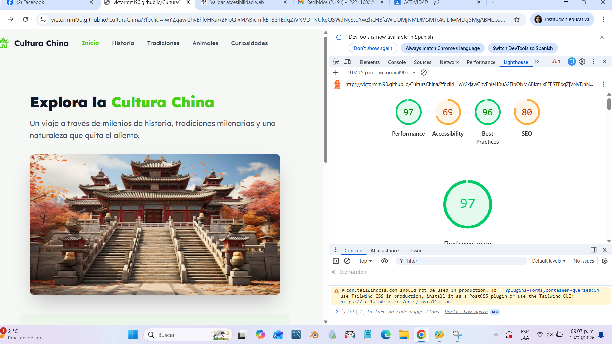

# CulturaChina
## Validación de Accesibilidad

Se realizó la validación de accesibilidad del sitio web utilizando herramientas como **Lighthouse** para analizar aspectos como:

- Accesibilidad
- Buenas prácticas
- Rendimiento
- SEO

A continuación se muestran los resultados obtenidos:

Estas pruebas permiten identificar problemas de accesibilidad y mejorar la experiencia para usuarios con diferentes necesidades.

---

## Prototipo de Interfaz

Se diseñó un prototipo de la interfaz de la aplicación web utilizando **Figma**, con el objetivo de planificar la estructura visual y la experiencia del usuario antes del desarrollo.

### Enlace del prototipo de interfaz

[Ver prototipo en Figma](https://www.figma.com/design/96X9wboQUgFccgWrBluFke/Untitled)

---

## Prototipo en la nube y retroalimentación

El prototipo fue compartido en la nube para permitir su visualización y recibir retroalimentación.

🔗 **Enlace al prototipo:**  
[Ver prototipo en la nube](https://victormml90.github.io/CulturaChina/)

